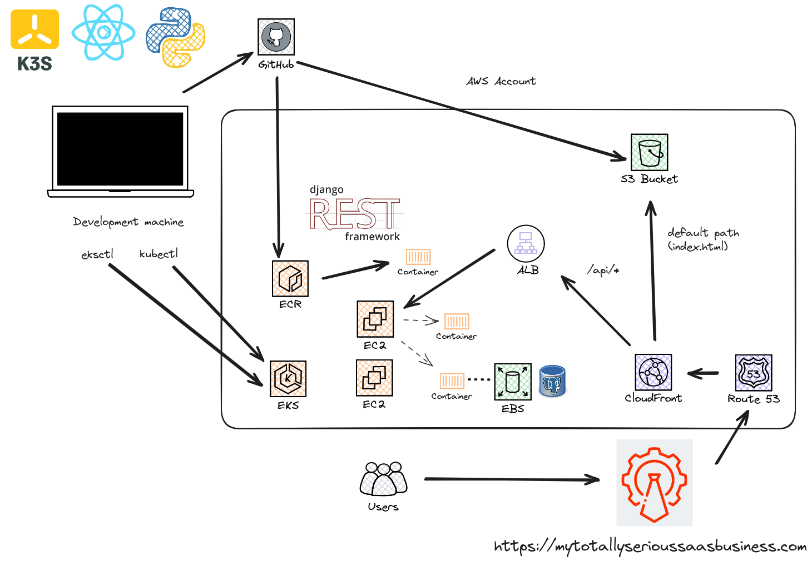

# A Sassy Backend

This is the backend for My Totally Serious Saas Business. It's Django REST Framework and sends back very important data that customers will benefit most highly from, even in their home prefectures!

## Architecture

Along with the [sassy-frontend](https://github.com/lpmi-13/sassy-frontend), this forms the API component of https://mytotallyserioussaasbusiness.com.



## Running Locally

Because the whole idea is to run this "in production" on EKS, the local runs are going to be via k3s (rather than something simpler like docker-compose).

So you'll need k3s installed, as well as Docker (for building/pushing the container images to the locally running container registry). Beyond that, you'll also need kubectl, but a k3s install should sort that out for you anyway.

For convenience, once you have k3s installed and running locally, you can run the following script to set everything up:

```sh
./scripts/setup_local_cluster.sh
```

and then you should be able to see what's happening in the cluster

```sh
kubectl get po -n sassy
NAME                             READY   STATUS    RESTARTS   AGE
postgres-0                       1/1     Running   0          85s
sassy-backend-5949f9445d-4qsh8   1/1     Running   0          84s
```

and then you can get the service IP to test out with curl if you want

```sh
kubectl get svc -n sassy
NAME            TYPE        CLUSTER-IP      EXTERNAL-IP   PORT(S)   AGE
postgres        ClusterIP   None            <none>        <none>    2m6s
sassy-backend   ClusterIP   10.43.207.232   <none>        80/TCP    2m5s
```

in which case you should be able to curl it and see a "forbidden" response (which is expected when passing no credentials):

```sh
curl 10.43.207.232/users/ | jq
  % Total    % Received % Xferd  Average Speed   Time    Time     Time  Current
                                 Dload  Upload   Total   Spent    Left  Speed
100    58  100    58    0     0  29667      0 --:--:-- --:--:-- --:--:-- 58000
{
  "detail": "Authentication credentials were not provided."
}
```

## Deployments

Updating the code in either the `backend/` folder or the `db-seed/` folders will build the related containers in GitHub actions and push them to ECR for consumption by EKS.